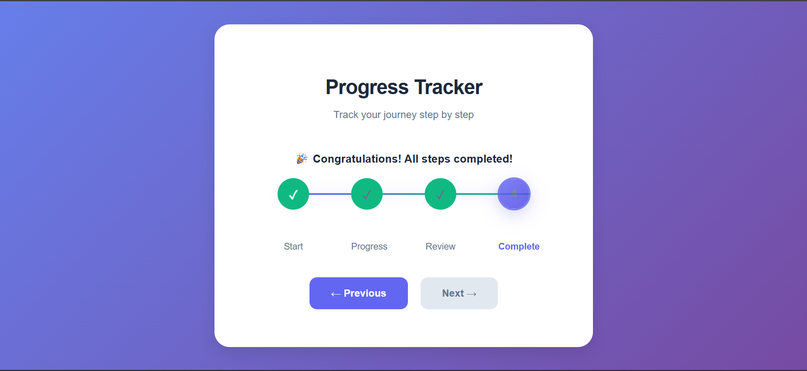

# 🚀 Modern Progress Stepper  

A sleek and modern **progress tracker** built using **HTML, CSS, and JavaScript**.  
It allows users to **navigate step by step**, view progress visually, and includes features like:  
- ✅ Step navigation with buttons & circles  
- ✅ Keyboard accessibility (arrow keys & enter/space)  
- ✅ Auto progression option  
- ✅ Responsive design for all devices  
- ✅ Smooth animations & completion celebration 🎉  

---

## 📸 Preview  

---

## 🛠 Tech Stack  

  
  
  

---

## ⚡ Live Demo  

🔗 **[Click here to view live]()**  

---

## ⚡ How to Use  

1. Clone this repo  
   
   git clone https://github.com/vighnesh204/Modern-Progress-Stepper.git
